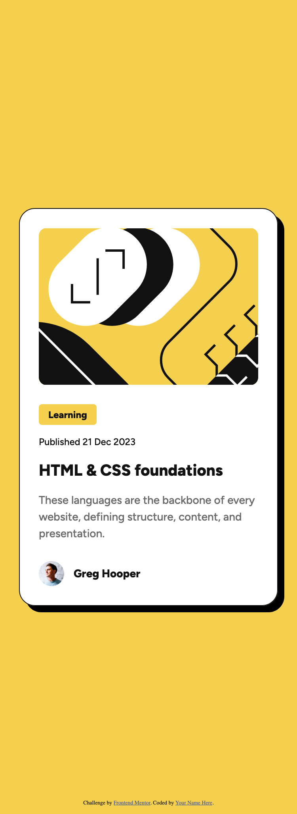
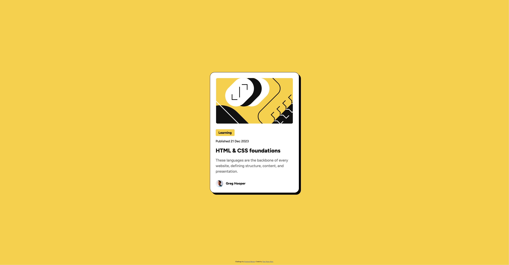

# Frontend Mentor - Blog preview card solution

This is a solution to the [Blog preview card challenge on Frontend Mentor](https://www.frontendmentor.io/challenges/blog-preview-card-ckPaj01IcS). Frontend Mentor challenges help you improve your coding skills by building realistic projects. 

## Table of contents

- [Overview](#overview)
  - [The challenge](#the-challenge)
  - [Screenshot](#screenshot)
  - [Links](#links)
- [My process](#my-process)
  - [Built with](#built-with)
  - [What I learned](#what-i-learned)
  - [Continued development](#continued-development)
  - [Useful resources](#useful-resources)
  - [AI Collaboration](#ai-collaboration)
- [Author](#author)

**Note: Delete this note and update the table of contents based on what sections you keep.**

## Overview

### The challenge

Users should be able to:

- See hover and focus states for all interactive elements on the page

### Screenshot





### Links

- Solution URL: [Solution](https://github.com/fsanz/blog-preview-card-main)
- Live Site URL: [live site URL](https://fsanz.github.io/blog-preview-card-main)

## My process

### Built with

- Semantic HTML5 markup
- CSS custom properties
- Flexbox
- Mobile-first workflow

### What I learned

I learned that:
it is possible to apply two css shadows. 
```css
	box-shadow:
		0.8rem 0.8rem var(--BLACK),
		1.6rem 1.6rem transparent;
```
@media queries are safer setted in px rather than rem, since it takes the font-size of the browser eventhough a font-size is set at root level. 
there is a time HTML element with a datetime attribute.
```html
<time datetime="2023-12-21" class="blog-card__publish-date">Published 21 Dec 2023</time>
```


**Note: note

### Continued development

I would like to know better about css animations


### Useful resources

- [gemini](https://gemini.google.com) - This helped me to get css classes names usign BEM
- [developer.mozilla](https://developer.mozilla.org) - To do general research about html and css.


### AI Collaboration

Describe how you used AI tools (if any) during this project. This helps demonstrate your ability to work effectively with AI assistants.

- I used AI to get css classes names usign BEM from the preview picture

**Note: Delete this note and the content above if you didn't use AI, or replace with your own experience.**

## Author

- Website - [fsanz](https://fsanz.github.io/inicio)
- Frontend Mentor - [@fsanz](https://www.frontendmentor.io/profile/fsanz)

**Note: Delete this note and add/remove/edit lines above based on what links you'd like to share.**

